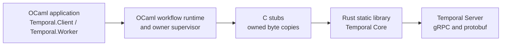

# OCaml Temporal SDK

[](https://github.com/Analytical-Tradecraft-Technologies/ocaml-temporal/actions/workflows/build.yml)

> **Community-maintained and unofficial. Not affiliated with or endorsed by Temporal Technologies, Inc.**

OCaml Temporal SDK is an experimental, pre-`0.1.0` implementation of a
Temporal SDK for OCaml 5. It is intended to let an OCaml application own a
worker that runs deterministic workflow code as well as activities. It is not
only a client for starting a workflow and reading its result.

The API and the native boundary may change while the worker implementation is
completed. The repository is useful today for experimenting with workflow
authoring, deterministic scheduling, typed payloads, the OCaml/Rust bridge,
and the first native worker command slice. It is not yet a drop-in replacement
for the mature Temporal SDKs.

## Architecture in one picture

The final application artifact is an OCaml executable. Rust is a private
static-library implementation detail of that executable; it is not a sidecar
process and it does not own the OCaml application.



One supervisor owns the Rust runtime, Temporal client, optional worker, and
their native lifetimes for one SDK instance. Public OCaml values do not expose
Rust handles, pointers, Tokio futures, or protobuf types.

OCaml and Rust exchange a small, private, strictly validated JSON protocol.
Both sides validate the complete document, copy bytes at the ownership
boundary, and return bounded typed errors. This JSON is an internal ABI choice:
it is not JSON sent to Temporal Server. Rust alone converts between the private
semantic records and Temporal Core's protobuf/gRPC messages. A workflow payload
may itself use the standard `json/plain` encoding, but Temporal payloads are
opaque bytes and applications may choose another deterministic codec.

## What works now

The audited source is [`beae10d0a58e`](https://github.com/Analytical-Tradecraft-Technologies/ocaml-temporal/commit/beae10d0a58e58fb8e076734cd38113d7a2b4466).
Its [September 19 Build run](https://github.com/Analytical-Tradecraft-Technologies/ocaml-temporal/actions/runs/35469570419)
passed the Linux/native build matrix and a separate Linux OCaml 5.5
Temporal/PostgreSQL live job. The [live evidence reference](docs/reference/live-acceptance-coverage.md)
links the exact tests, controller commands, and limits; build success on other
platforms does not establish live compatibility there.

| Area | Current evidence and boundary |
| --- | --- |
| Workflow authoring | Typed definitions, codecs, direct-style suspension, futures, conditions, deterministic time/randomness, and cancellation scopes have focused unit/runtime tests. Live fixtures exercise timer/activity/child waits and selected replay paths. |
| Activities | Remote execution, retries, heartbeat details/timeouts, non-immediate retry, and retained asynchronous completion have live scenarios. `smoke.local_activity` live-verifies local activity success; local retry/backoff and cancellation variants have focused tests, not a complete live conformance suite. |
| Child workflows | Success, propagated failure, explicit child cancellation, child retry, and duplicate-ID start failure are live-tested. Separate controllers verify exact parent/child replay after worker replacement and a child failing after replay while its parent recovers. |
| Client and interactions | Exact-run start/wait/cancel/terminate, continue-as-new following, direct and external signals, both query forms, typed update completion, unknown-handler rejection, and external cancellation have live assertions. External signal rejection against a completed target and wrong-run cancellation rejection are also exercised. Reset, visibility, and interaction recovery/deadline coverage remain incomplete. |
| Recovery and patching | Live controllers exercise graceful replacement, forced crash recovery, sticky-cache eviction, parent/child recovery, and marker-free to active, active to deprecated, and deprecated to removed patch histories. These fixtures do not establish arbitrary-history compatibility. |
| Cancellation | [`Temporal.Scope`](docs/reference/workflow-scopes.md) wakes observers and invokes exactly-once cancellation hooks for remote activities and child workflows started with `~scope`. This is implemented and focused-tested; it does not preempt an activity callback or implicitly cancel timers or losing futures. |
| Native boundary | An OCaml-owned supervisor manages the private C/Rust/Core graph. Focused tests cover copied payloads, strict protocol validation, handle ownership, retryable completion drainage, and shutdown. |

## What is deliberately still pending

- The SDK remains experimental and pre-`0.1.0`. A v1 support/compatibility
  decision is tracked in [#489](https://github.com/Analytical-Tradecraft-Technologies/ocaml-temporal/issues/489);
  implemented or live-tested behavior is not a production support promise.
- HTTP(S) endpoint configuration exists, but public authentication, custom
  trust/mTLS/API-key configuration and secure-endpoint acceptance remain work.
  The live fixture uses a local plaintext Temporal endpoint.
- Running activity callbacks are serialized. Scope cancellation commands,
  activity task cancellation, and worker shutdown are separate mechanisms;
  application-visible cooperative callback cancellation and bounded operational
  shutdown qualification remain incomplete.
- A public replay API/history tool, wider history and Server/Core compatibility
  corpora, local-activity recovery, worker deployment routing acceptance,
  suspended-update recovery, and broader failure/load testing remain open.
- Schedules, Nexus, interceptors, workflow side effects, and other parity work
  remain incomplete. Release preflight and package tests exist; release delivery,
  provenance, upgrade rehearsal, and operational qualification are separate gates.

See [feature coverage](docs/reference/feature-coverage.md) for the focused-test
boundary and [live acceptance coverage](docs/reference/live-acceptance-coverage.md)
for named scenarios and reproducible commands. The [generated inventory](docs/reference/live-acceptance-inventory.md)
tracks current controller and fixture definitions without repeating stale start
totals throughout the documentation.

## Quick start

Requirements: Docker with Compose v2 and GNU Make. The normal build and test
path does not require OCaml, Dune, Rust, or Python installed on the host.

```sh
make build                    # build OCaml and the pinned Rust bridge
make test-unit                # codecs, definitions, client/worker API tests
make test-runtime             # deterministic runtime and native adapter tests
make verify                   # version check, lint, all Dune/Rust/bridge tests
make quality                  # pinned Rust quality and spelling tools
make license-check            # permissive dependency audit
make test-temporal-integration # real PostgreSQL + Temporal + two OCaml binaries
make test-temporal-workflow-patching # contract plus three-stage patch lifecycle replay
make test-temporal-parent-child-restart # bilateral exact-run recovery target
```

The default development image uses OCaml 5.2. To try another supported image,
pass `OCAML_VERSION`, for example `make verify OCAML_VERSION=5.5`. CI has a
fast representative pull-request gate and an exhaustive compatibility gate. A
code PR verifies Linux amd64 with OCaml 5.2 and 5.5, Linux arm64 with OCaml
5.5, macOS ARM64 with OCaml 5.5, the pinned quality and dependency-license
checks, and the OCaml 5.5 Temporal/PostgreSQL smoke. The Windows x64 OCaml 5.5
native job is added to a PR when changes affect the native bridge,
build/toolchain, workflow, or composite-action configuration. JSON protocol
schemas under `docs/schemas/` are treated as code for this policy. Pushes to `master` and
scheduled runs retain the exhaustive Linux matrix (OCaml 5.2–5.5 on amd64 and
arm64) plus both OCaml 5.5 native desktop jobs. The standalone license audit is
run once per workflow, not once per
matrix cell. These entries describe configured jobs, not evidence that a
particular Actions run has completed; runs may remain queued while the
repository quota is exhausted. The workflow cancels superseded runs for the
same pull request (or the master push ref), while each job timeout starts only
after GitHub allocates a runner; GitHub does not provide a native timeout for a
job that is still waiting in the quota queue.

CI builds the Rust bridge once per operating system and architecture, sharing
the Linux libraries across OCaml versions and the live smoke. Exact-input
caches populated by `master` also serve PR, merge-queue, and scheduled runs.
The C stubs, OCaml libraries, installed consumers, and their tests still build
in every compatibility lane. See [Rust artifact sharing](docs/reference/quality-gates.md#rust-artifact-sharing)
for the cache boundaries and local producer/consumer commands.

When Actions is queued, use `make check OCAML_VERSION=5.2` as the representative
Docker-backed local baseline. It combines `make verify` with the package/OCaml
license audit. Run `make quality` separately when the pinned native
`cargo-deny`, `cargo-machete`, and `typos` binaries are installed; CI installs
the checksum-verified versions. On Windows or macOS, `make native-verify`
exercises the corresponding OCaml 5.5/Rust native compatibility path. The
locked Cargo license scanner runs once in its isolated CI job and is not
claimed by `make license-check`; `make test-temporal-integration` is the
optional, expensive live Temporal Server/PostgreSQL check. Local results are
interim evidence only and do not turn an unexecuted matrix, platform, or live
server job green.

On a memory-constrained Docker VM, bound Dune's native build concurrency with
`make build DUNE_JOBS=1`; leaving `DUNE_JOBS` unset preserves the default
parallelism used by CI.

### Install from a source checkout

The checked-in package version is `~dev`. To install the current checkout into
an existing OPAM switch, use OCaml 5.2 or newer, Dune 3.18 or newer, and Rust
1.94 or newer, with the Protocol Buffers compiler (`protoc`) available, then
run:

```sh
opam install --with-test .
```

The OPAM metadata depends on `conf-rust-2024` and `conf-protoc`, so dependency
resolution checks that `cargo`, a compiler supporting Rust edition 2024, and
`protoc` are available before Dune builds the private native bridge. Cargo
still enforces the package's more specific Rust 1.94 minimum from
`rust/Cargo.toml`. Applications link only the installed `temporal-sdk` library
and use the wrapped `Temporal` module; the native build tools are prerequisites,
not part of the public OCaml API.

### The real Temporal smoke

`make test-temporal-integration` starts the pinned Temporal Server and
PostgreSQL containers from a fresh Compose project, checks SQL/frontend health,
runs the Core lifecycle test, then runs a public OCaml worker and an independent
public OCaml client driver. The driver stages the workflows in the
[generated inventory](docs/reference/live-acceptance-inventory.md), waits for
worker-visible readiness before control operations, and checks exact-run terminal
outcomes. The timeout retry fixtures are serialized after the shorter heartbeat
path so a busy callback lane cannot masquerade as a server timeout test.

The [audited live job](https://github.com/Analytical-Tradecraft-Technologies/ocaml-temporal/actions/runs/35469570419/job/105967951226)
passed with Temporal Server 1.32.0 and PostgreSQL 18.6 on Linux OCaml 5.5.
It also executed the separate restart, crash recovery, cache eviction, patching,
parent/child restart, and child-failure-after-replay controllers. See the
[live evidence reference](docs/reference/live-acceptance-coverage.md) for
commit-pinned definitions and the exact assertion boundaries.

Each controller owns fixture cleanup. The baseline checks client shutdown and
the worker's graceful-stop marker, and removes the PostgreSQL volume before and
after acceptance. These checks do not measure a shutdown deadline or demonstrate
production durability across infrastructure replacement.

### Workflow-patch replay acceptance

`make test-temporal-workflow-patching` is separate from the baseline smoke. It
first runs `make test-temporal-workflow-patching-contract`, then starts the
same isolated PostgreSQL and Temporal Server topology with a client-only OCaml
driver and separate OCaml worker processes. The driver starts and waits for
exact workflow/run handles; it never registers workflow or activity code.

The live controller proves three real source-replacement cases for one stable
patch ID. First, a legacy worker whose workflow definition contains
no `patched` call reaches a durable timer. Its normalized initial and terminal
histories must contain no patch marker; a fresh patch-aware replacement worker
must report replay and complete the legacy activity branch. Second, a patched
worker starts a new run, whose initial and terminal histories must contain one
non-deprecated marker; a deprecation-only replacement must report replay,
preserve that false marker, and complete the new behavior. Third, a deprecation
worker creates a true marker before a separately compiled source containing no
patch API replays and completes it. Each case uses distinct worker containers,
and the driver requires the exact branch-specific terminal result.

The Docker-free companion checks the checked-in normalized-history,
diagnostics, and controller fixtures and their rejection paths. It does not
build workers, start containers, contact Temporal Server, or establish that a
replay occurred. The complete [PR #348 CI
run](https://github.com/mfow/ocaml-temporal/actions/runs/29411260374) is the
corresponding real-server evidence for the original cases; the complete [PR
#356 run](https://github.com/mfow/ocaml-temporal/actions/runs/29469232271)
verifies the expanded lifecycle cases. Deployment-based routing, arbitrary
historical compatibility, and migration tooling remain separate; legacy
build-ID worker routing is covered by bilateral bridge tests but still needs a
dedicated live routing gate.
See [workflow patching](docs/reference/workflow-patching.md)
for the authoring and replay contract.

### Parent/child restart and replay acceptance

`make test-temporal-parent-child-restart` runs a client-only OCaml binary and
two sequential instances of a worker-only OCaml binary. The controller derives
the exact child run from the exact parent's server history, replaces the worker
while both executions are pending, and validates replay plus terminal
correlation for both runs. The
[acceptance reference](docs/reference/parent-child-restart-replay-acceptance.md)
documents its private checkpoint and evidence boundary. The
[audited live job](https://github.com/Analytical-Tradecraft-Technologies/ocaml-temporal/actions/runs/35469570419/job/105967951226)
also runs `make test-temporal-parent-child-failure-replay`: both executions must
replay before the child fails and the parent returns its recovered result.
The [failure acceptance reference](docs/reference/child-failure-replay-acceptance.md)
explains the additional history assertions.

For manual inspection, use `make temporal-start`, `make temporal-health`,
`make temporal-status`, `make temporal-logs`, and `make temporal-clean`.
Running Compose directly from the repository root is unsupported; the Makefile
selects the fixture and its project directory for you. See the [local stack
reference](docs/reference/local-temporal-stack.md) for the exact acceptance
boundary and cleanup behavior.

## A small workflow example

Workflow code is direct-style OCaml. This example turns one name into a short
two-line message: it asks a separate activity worker to render a greeting and
a next step, records a durable pause, and returns their results together. A
future represents a result that may arrive in a later Temporal activation;
`Future.await` suspends only the current workflow fiber. Expected operational
failures are values, so helpers compose with `result` rather than using
exceptions for control flow.

```ocaml
let render_message =
  Temporal.Activity.remote
    ~name:"ocaml-temporal-example.render-message"
    ~input:Temporal.Codec.string
    ~output:Temporal.Codec.string

let compose_message name =
  let open Temporal.Result_syntax in
  let name = String.trim name in
  if String.equal name "" then
    Error (Temporal.Error.defect ~message:"a name is required")
  else
    let greeting =
      Temporal.Activity.start render_message ("greeting:" ^ name)
    in
    let next_step =
      Temporal.Activity.start render_message ("next-step:" ^ name)
    in
    let pause =
      Temporal.Workflow.start_sleep (Temporal.Duration.of_ms 250L)
    in
    let* messages, () =
      Temporal.Future.await
        (Temporal.Future.both (Temporal.Future.all [ greeting; next_step ])
           pause)
    in
    Ok (String.concat "\n" messages)

let compose_message_workflow =
  Temporal.Workflow.define
    ~name:"ocaml-temporal-example.compose-message"
    ~input:Temporal.Codec.string
    ~output:Temporal.Codec.string
    compose_message
```

Both activities and the timer are started before anything is awaited, so
Temporal can make independent progress while replay always sees the same command
order. `compose_message` and its ordinary helpers are just OCaml functions;
only explicit SDK operations such as activity scheduling or a durable timer
create Temporal history commands. This example is covered by the deterministic
runtime and the current native activity/timer command slice; it is not a claim
that every future Temporal feature is complete.

The complete, buildable version is split the way a real deployment often is:

- [Workflow worker](examples/workflow_worker/workflow_worker.ml) registers the
  deterministic workflow and shuts down gracefully on `SIGINT` or `SIGTERM`.
- [Activity worker](examples/activity_worker/activity_worker.ml) registers the
  activity implementation, the appropriate boundary for external work.
- [Client](examples/client/client.ml) connects, starts one exact workflow run,
  waits for its typed terminal result, prints it, and releases the connection.

See the [examples guide](examples/README.md) for the startup order, connection
settings, and commands. CI compiles all three executables on every Docker and
native build without running them.

See [Writing Workflows in OCaml](docs/guides/workflows.md) for codecs, worker
registration, client handles, child-workflow boundaries, futures, and
determinism rules.

## Logging

The SDK reports application-configurable events through the OCaml `logs`
library. Stable sources include `temporal.sdk.lifecycle`,
`temporal.sdk.bridge`, and `temporal.sdk.workflow`, with structural operation,
error-kind, and elapsed-time tags. The library does not install a reporter or
choose a global log level. Payload bytes, workflow arguments, and bridge JSON
are excluded from log messages. See the [observability reference](docs/reference/observability.md).

## Further documentation

- [Documentation guide and glossary](docs/README.md)
- [Supported public API map](docs/reference/public-api-map.md)
- [Workflow authoring guide](docs/guides/workflows.md)
- [Architecture specification](docs/superpowers/specs/2026-07-11-ocaml-temporal-sdk-design.md)
- [Implementation roadmap](docs/implementation-roadmap.md)
- [Runtime invariants](docs/reference/runtime-invariants.md)
- [Native Core bridge and ownership](docs/reference/core-bridge.md)
- [Private JSON control protocol](docs/reference/core-protocol.md)
- [Native client JSON protocol](docs/reference/client-protocol.md)
- [Native workflow execution](docs/reference/native-worker-execution.md)
- [Native execution translation](docs/reference/native-execution-translation.md)
- [Native activity protocol and execution](docs/reference/activity-protocol.md)
  and [activity execution lifecycle](docs/reference/native-activity-execution.md)
- [Deterministic workflow time](docs/reference/workflow-time.md)
- [Interactive workflows](docs/reference/interactive-workflows.md) and the
  [native interaction design](docs/design/native-interactions.md)
- [Logging and observability](docs/reference/observability.md)
- [Feature coverage and implementation status](docs/reference/feature-coverage.md)
- [Workflow patching and replay contract](docs/reference/workflow-patching.md)
- [Worker versioning](docs/reference/worker-versioning.md)
- [Live acceptance coverage](docs/reference/live-acceptance-coverage.md)
- [Worker restart and replay acceptance](docs/reference/worker-restart-replay-acceptance.md)
- [Worker restart/replay diagnostic contract](docs/reference/worker-restart-replay-diagnostics.md)
- [Replay bridge](docs/reference/replay-bridge.md)
- [Installed package boundary](docs/reference/package-boundary.md)
- [Local Temporal and PostgreSQL stack](docs/reference/local-temporal-stack.md)
- [Quality and security gates](docs/reference/quality-gates.md)
- [Dependency and license inventory](docs/dependencies.md)
- [Verified progress](docs/progress.md)

## License

Project source is licensed under [Apache-2.0](LICENSE). Dependencies must pass
the repository's permissive-license policy; ordinary GPL, AGPL, LGPL, and
other copyleft or source-available dependencies are prohibited. The only
standing exception is the narrowly reviewed OCaml linking exception documented
in the dependency inventory.

## AI disclosure

AI coding tools were used to generate substantial portions of this project.
All committed code in published releases has been reviewed by the maintainer,
who accepts responsibility for its correctness, security, licensing, and
ongoing maintenance. No unreviewed model output is released.

AI models used to help build this project:

### OpenAI
- GPT-6
- GPT-5
- GPT-5.5
- GPT 5.6 Sol
- GPT 5.6 Terra
- GPT 5.6 Luna

### xAI
- Grok 4.5

### Anthropic
- Fable 5
- Opus 4.8
- Sonnet 5
